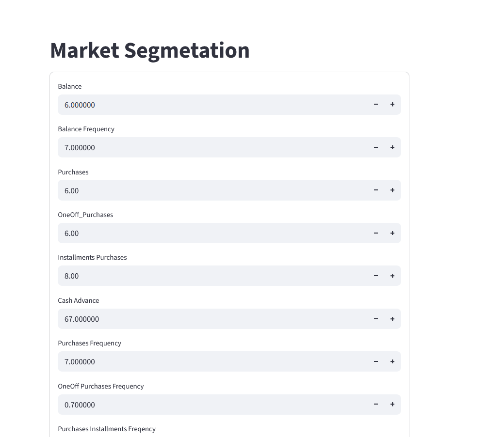
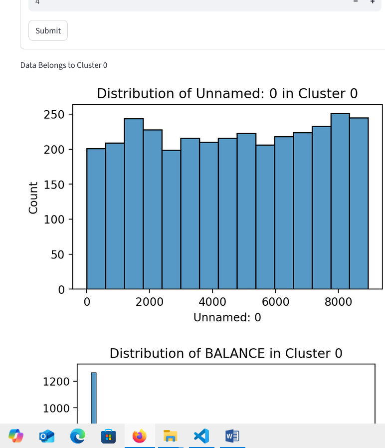
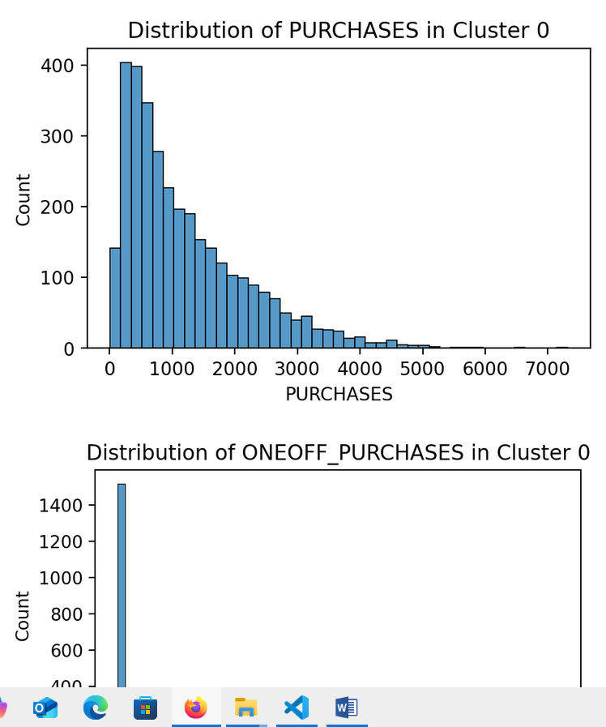
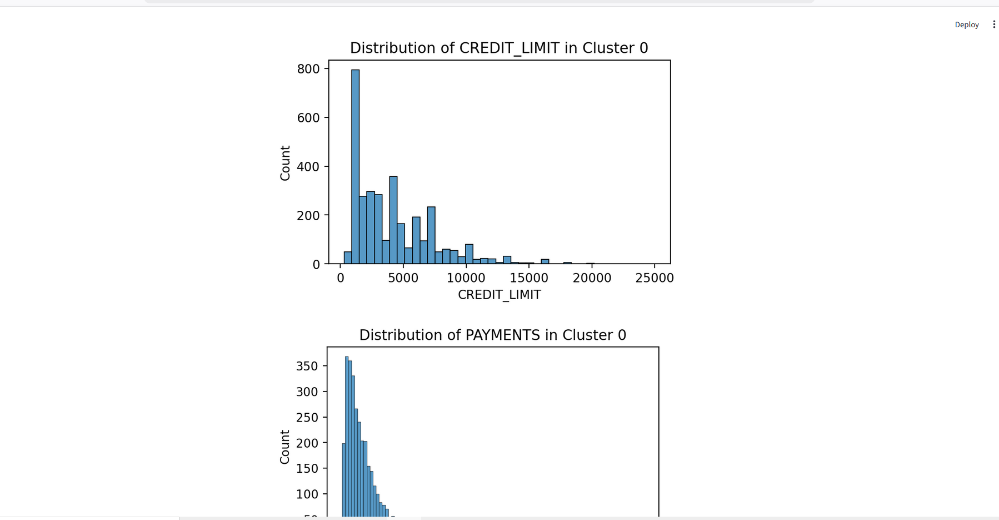
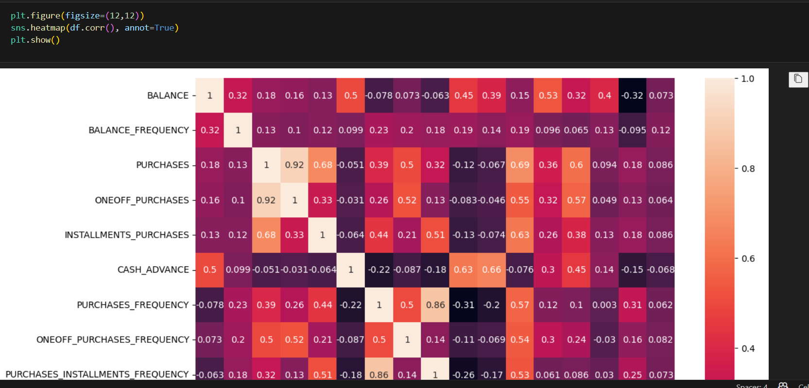

## Market Segmentation Using Machine Learning
# Project Overview

This project is a Market Segmentation system that automatically groups customers into clusters based on their financial behavior. The system uses unsupervised learning (KMeans clustering), combined with PCA for dimensionality reduction, and visualizes patterns in customer data.

The goal is to help businesses identify customer segments, enabling better marketing strategies, personalized offers, and improved decision-making.

# Problem Statement

Traditional customer segmentation is time-consuming and error-prone. This project solves that problem by:

Automatically analyzing customer financial data

Identifying clusters of similar customers

Visualizing the clusters for easy interpretation

# Project Structure
Market-Segmentation/
|__ results_images/
|______IMAGES
├── app.py                
├── models.py              
├── preprocessing.py      
├── visualization.py     
├── Customer Data.csv     
├── Clustered_Customer_Data.csv  
├── final_model.sav       
├── kmeans_model.pkl 
|__ requirments.txt   
└── README.md             

Source: Customer financial data

Features: Balance, Purchases, Cash Advance, Credit Limit, Payments, Tenure, etc.

Target: Clusters (created using KMeans)

Size: Depends on CSV file provided

# Data Preprocessing

The preprocessing steps include:

Scaling numeric features using StandardScaler

Removing irrelevant columns like CUST_ID

Preparing data for clustering and modeling

# Machine Learning Pipeline
1. Clustering

Algorithm: KMeans

Number of clusters: 4 (optimized using the Elbow method)

Purpose: Segment customers into groups with similar behaviors

Output: Clustered_Customer_Data.csv with cluster labels

2. Dimensionality Reduction

Algorithm: PCA

Components: 2

Purpose: Visualize high-dimensional data in 2D

3. Supervised Modeling

Algorithm: Decision Tree Classifier

Purpose: Predict cluster for new customer data

Performance: High predictive accuracy on test data

# Resluts :

# Visualizations

Visual insights are generated using Matplotlib, Seaborn, and Plotly:

Histograms: Distribution of features per cluster

Cluster plots: 2D visualization after PCA

Elbow Method Plot: To determine optimal number of clusters

Example:

Distribution of features in each cluster helps understand customer segments.

# Streamlit App

The app (app.py) allows interactive exploration:

Input customer financial data

Predict which cluster the customer belongs to

Visualize distributions of features in the predicted cluster

Supports interactive and real-time visualization

# How to Run

Train and save models:

python models.py

Run Streamlit app:

streamlit run app.py

Explore clusters and visualizations interactively

# Author

Nisar Ahmad Zamani
Machine Learning & Data Science Enthusiast
Github : https://github.com/NisarAhmad7